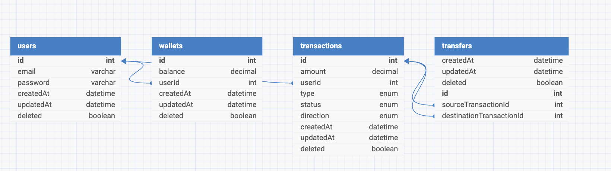

# **Lendsqr Demo Credit - Project Overview**

### **Table of Contents**
1. [Introduction](#introduction)
2. [Technology Stack](#technology-stack)
3. [Project Structure](#project-structure)
4. [Database Design](#database-design)
5. [RESTful API Design](#restful-api-design)
6. [Business Logic](#business-logic)
7. [Validation and Error Handling](#validation-and-error-handling)
8. [Transaction Scoping](#transaction-scoping)
9. [Setting Up the Project](#setting-up-the-project)
10. [Running Tests](#running-tests)
11. [Future Improvements](#future-improvements)

---

## **Introduction**

This project is a demo credit application that provides financial functionalities such as managing users, wallets, transactions, and transfers. The goal of the system is to allow users to:
- Create wallets.
- Fund and withdraw from wallets.
- Transfer funds between wallets.
- Track transactions and ensure data integrity using atomic operations.

The project implements best practices in software engineering, including **Object-Oriented Programming (OOP)** principles, **RESTful API design**, **database normalization**, and **transaction scoping** to ensure data consistency.

---

## **Technology Stack**

- **Node.js (TypeScript)**: Backend runtime for handling business logic and API requests.
- **Knex.js**: SQL query builder for interacting with the database and performing migrations.
- **MySQL**: Relational database management system for storing user, wallet, and transaction data.
- **Express**: Node.js web framework for building the API.
- **Jest**: Testing framework used for writing unit and integration tests.
- **Dotenv**: For managing environment variables in different environments.
- **bcrypt**: For secure password hashing.

---

## **Project Structure**

The project is organized using a **Model-View-Controller (MVC)** architecture to ensure a clear separation of concerns:

```
├── config/               # Environment and configuration files
├── controllers/          # Handles API requests and delegates logic to services
├── databases/            # Knex migrations and seed files
├── middlewares/          # Authentication and validation middleware
├── models/               # Database models and schema
├── routes/               # Route definitions for the API
├── services/             # Core business logic and database interactions
├── tests/                # Unit and integration tests
├── utils/                # Utility functions (e.g., logging, error handling)
└── app.ts                # App entry point
```

### **Key Directories and Files**:
- **Controllers**: Responsible for processing incoming API requests, interacting with services, and returning responses to the client.
- **Services**: Implements the core business logic (e.g., managing wallet balances, processing transactions).
- **Models**: Defines the structure of database entities using Knex.js for database interactions.
- **Routes**: Manages routing between the API paths and the controllers.
- **Middlewares**: Handles cross-cutting concerns like authentication and validation.

---

## **Database Design**

### E-R diagram


The database is structured to ensure **data normalization** and proper relationships between key entities. The schema includes the following tables:

### **Tables**:
1. **Users**
   - Stores user details like email, password, and creation date.
   - `id` is the primary key.
  
2. **Wallets**
   - Each user can have one or more wallets.
   - Stores the balance, user reference (`userId`), and timestamps.
   - `userId` is a foreign key linked to `users.id`.

3. **Transactions**
   - Tracks every financial action (funds added, withdrawn, or transferred).
   - Stores the amount, type (fund, withdraw, transfer), status, and direction (credit, debit).
   - `userId` is a foreign key linked to `users.id`.

4. **Transfers**
   - Manages fund transfers between two wallets.
   - Each transfer is represented by two transactions (debit and credit).
   - `sourceTransactionId` and `destinationTransactionId` are foreign keys linked to `transactions.id`.

### **Relationship Overview**:
- **1-to-Many**: Users to Wallets (one user can have multiple wallets).
- **1-to-Many**: Users to Transactions (one user can have multiple transactions).
- **Many-to-Many**: Transactions to Transfers (each transfer consists of two transactions).

---

## **RESTful API Design**

The API follows RESTful conventions, with clear endpoints representing the core resources (users, wallets, transactions, and transfers). HTTP methods like `GET`, `POST`, and `DELETE` are used to manipulate these resources.

### **Core Endpoints**:

1. **User Routes**:
   - `GET /users`: Fetch all users.
   - `POST /users`: Create a new user.

2. **Wallet Routes**:
   - `GET /wallets`: Fetch all wallets for the authenticated user.
   - `POST /wallets/fund`: Fund the user’s wallet.
   - `POST /wallets/withdraw`: Withdraw funds from the user’s wallet.
   - `POST /wallets/transfer`: Transfer funds between wallets.

3. **Transaction Routes**:
   - `GET /transactions`: Fetch all transactions for the authenticated user.
   - `POST /transactions`: Create a new transaction.

### **Path Design Rationale**:
- **Resources** are represented as nouns (e.g., `users`, `wallets`, `transactions`).
- **Actions** are implied by HTTP methods (e.g., `POST /wallets/fund` implies adding funds).
- **Hierarchical Paths**: Routes are designed to reflect the hierarchy between entities (e.g., `/users/:userId/wallets`).

---

## **Business Logic**

The core business logic is encapsulated in **service classes**, which are responsible for handling complex operations such as funding wallets, processing transactions, and transferring funds between users.

### **Key Business Logic Components**:
- **WalletService**: Manages wallet operations (funding, withdrawing, and transferring funds).
- **TransactionService**: Records all financial transactions and manages their statuses.
- **TransferService**: Ensures that transfers between users are properly processed, and both debit and credit transactions are recorded.

Each operation is designed to ensure **data consistency** and **transaction scoping** (see below).

---

## **Validation and Error Handling**

### **Data Validation with DTOs**:
**Data Transfer Objects (DTOs)** are used to validate incoming requests. DTOs ensure that the correct data format is passed before processing:
- **Example**: `FundWalletDto` checks that the `amount` field is present and is a valid number before allowing the funding request to proceed.

### **Error Handling**:
Custom error classes like `HttpException` provide consistent error handling across the application. All errors are caught and returned with proper HTTP status codes (e.g., 400 for validation errors, 500 for internal server errors).

---

## **Transaction Scoping**

In operations like **funding wallets** and **transferring funds**, multiple related database operations are grouped into a single transaction to ensure atomicity. This ensures that either all operations succeed, or none are committed to the database.

### **Example: Transfer Operation**:
- **Step 1**: Deduct funds from the source wallet.
- **Step 2**: Add funds to the destination wallet.
- **Step 3**: Record the transaction as "completed."
- If any step fails, the entire operation is rolled back, ensuring no partial updates.

---

## **Setting Up the Project**

### **Requirements**:
- **Node.js**: v14+
- **MySQL**: For the relational database
- **npm**: Package manager

### **1. Clone the Repository**:
```bash
git clone <repository-url>
cd lendsqr-demo-credit
```

### **2. Install Dependencies**:
```bash
npm install
```

### **3. Setup Environment Variables**:
Create a `.env` file from the `.env.example` file and fill in the required database and secret keys:
```bash
cp .env.example .env
```

### **4. Run Migrations**:
Run the Knex migrations to set up the database schema:
```bash
npx knex migrate:latest
```

### **5. Start the Application**:
```bash
npm run dev
```

---

## **Running Tests**

The project uses **Jest** for testing. Tests cover key components like services and controllers to ensure business logic works as expected.

### **Run Tests**:
```bash
npm run test
```

---

## **Future Improvements**

### **1. API Versioning**:
Introduce API versioning (e.g., `/api/v1/`) to allow backward compatibility as new features are added.

### **2. Improved Error Handling**:
Expand the error-handling system to log errors more effectively, potentially using a logging service like Winston or an external tool like Sentry.

### **3. Pagination and Filtering**:
Add pagination and filtering options to endpoints like `GET /transactions` for better performance with large datasets.

### **4. Test Coverage**:
Expand test coverage, especially for edge cases and failure scenarios related to transaction handling.
